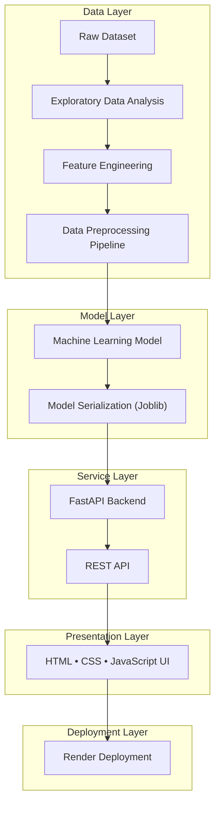

<div align="center">
  
</div> 
 
<div align="center"> 
    


</div> 

---

## Table of Contents ୨ৎ
 
- [Overview](#overview)
- [Project Architecture](#project-architecture)
- [Implementation Workflow](#implementation-workflow)
  - [Step 1: Data Exploration](#step-1-data-exploration)
  - [Step 2: Feature Engineering](#step-2-feature-engineering)
  - [Step 3: Model Training](#step-3-model-training)
  - [Step 4: Model Serialization](#step-4-model-serialization)
  - [Step 5: Backend Development](#step-5-backend-development)
  - [Step 6: Frontend Development](#step-6-frontend-development)
  - [Step 7: Deployment](#step-7-deployment)
- [Tech Stack](#tech-stack)
- [Project Structure](#project-structure)
- [Why This Project](#why-this-project)
- [Built By](#built-by)
---

---

## Overview ୨ৎ

An end-to-end Machine Learning project that predicts Airbnb room types across New York City. It spans the full ML lifecycle — from data exploration and feature engineering through model training, serialization, API development, and cloud deployment — resulting in a fully interactive web application rather than a standalone notebook.

---

## Project Architecture ୨ৎ

The system follows a linear pipeline, organized into five logical layers that carry the data from raw input to a deployed, user-facing application:



---

## Implementation Workflow ୨ৎ

Each stage below documents the engineering behind the pipeline shown above, from raw data to a live deployment.

### Step 1: Data Exploration

The raw dataset was examined to understand its structure, quality, and underlying patterns.

**Key activities:**
- Dataset inspection
- Missing value analysis
- Feature distribution analysis
- Correlation analysis
- Outlier detection

**Libraries used:** Pandas, NumPy, Matplotlib, Seaborn

---

### Step 2: Feature Engineering 

The dataset was cleaned and transformed ahead of model training. Preprocessing included:

- Handling missing values
- Encoding categorical variables
- Numerical feature preparation
- Building a reusable preprocessing pipeline

---

### Step 3: Model Training 

A complete Scikit-Learn pipeline was trained and exported using Joblib, ensuring that the exact same preprocessing logic is applied at inference time. This eliminates training-serving inconsistencies.

---

### Step 4: Model Serialization 

The trained pipeline was exported as:

```
Model_Pipeline.pkl
```

This file is loaded directly by the FastAPI backend.

---

### Step 5: Backend Development 

The prediction service was built using **FastAPI**, with the following features:

- REST API
- Input validation using Pydantic
- Structured prediction responses
- Probability output
- CORS support
- Clean endpoint architecture

**Available endpoints:**

```
GET /
POST /predict
```

---

### Step 6: Frontend Development 

A lightweight frontend was built using:

- HTML
- CSS
- JavaScript

It collects user input, sends requests to the FastAPI backend, and displays the prediction results — turning the trained model into an interactive web application rather than a notebook demonstration.

---

### Step 7: Deployment 

The application was deployed on **Render**, making the trained model accessible through a hosted API. This involved:

- Dependency management
- Runtime configuration
- Model loading
- API hosting

---

## Tech Stack 

| Category | Technologies |
|-----------|-------------|
| Programming | Python |
| Backend | FastAPI |
| Validation | Pydantic |
| Machine Learning | Scikit-Learn |
| Data Processing | Pandas, NumPy |
| Visualization | Matplotlib, Seaborn |
| Model Storage | Joblib |
| Frontend | HTML, CSS, JavaScript |
| Deployment | Render |

---

## Project Structure 

```
NYC-Airbnb-Room_Type-Predictor
│
├── main.py
├── Model_Pipeline.pkl
├── index.html
├── style.css
├── script.js
├── requirements.txt
├── runtime.txt
└── nyc_airbnb_room_type_classification.ipynb
```

---

## Why This Project 

This repository goes beyond model training to demonstrate a complete, end-to-end Machine Learning workflow, including:

- Data preparation
- Feature engineering
- Preprocessing pipeline design
- Model persistence
- API development
- Frontend integration
- Cloud deployment

The goal was to build a project that mirrors how Machine Learning models are actually packaged and served in production — not just how they're prototyped in a notebook.

---

## Built By ୨ৎ

**Abhishek Grover**

Machine Learning • AI Engineering • Data Science

[](https://www.linkedin.com/in/abhishek-grover07/)
[](mailto:ss107456@gmail.com)
